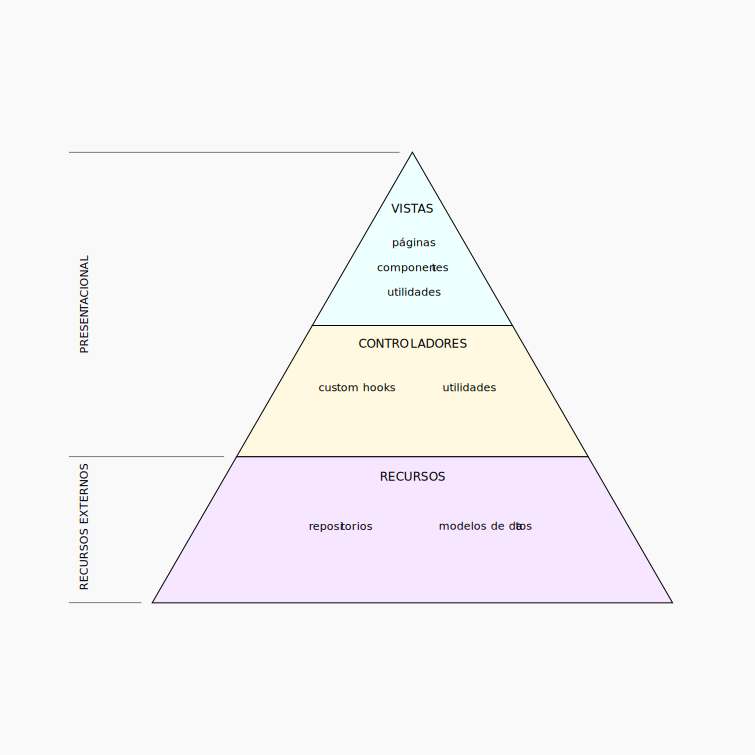

# J2D Hackathon Test
Autor: ``Jesús Barrientos`` - LinkedIn: [visitar perfil](https://www.linkedin.com/in/jesusbarrientos) 👋

🇨🇱 🇪🇸

## Tabla de contenidos
- [Descripción](#descripción)
- [Tecnologías utilizadas](#tecnologías-utilizadas)
- [Instalación](#instalación)
- [Variables de entorno](#variables-de-entorno)
- [Demo](#demo)
- [Arquitectura del proyecto](#arquitectura-del-proyecto)
  - [Decisiones de arquitectura](#decisiones-de-arquitectura)
  - [El concepto](#el-concepto)
  - [Estructura de carpetas](#estructura-de-carpetas)
- [Licencia](#licencia)

## Descripción
Este es un proyecto realizado para el Hackathon de J2D, el cual consiste en un sitio web
que liste los personajes de la serie animada "Rick And Morty".
---

## Tecnologías utilizadas

- React.js (Vite)
- Sass (.scss)
- Typescript
---

## Instalación
Para instalar el proyecto, se debe clonar el repositorio y ejecutar el siguiente comando:
```
yarn install
```
Luego, para ejecutar el proyecto en modo desarrollo, se debe ejecutar el siguiente comando:
```
yarn dev
```
Para ejecutar el proyecto en modo producción, se deben ejecutar los siguientes comandos:
```
yarn build
```
luego:
```
yarn preview
```
---

## Variables de entorno
- ``VITE_API_URL``: URL de la API de Rick And Morty
---

## Demo
Para ver el demo del proyecto, se debe ingresar al siguiente enlace:
[visitar sitio web](https://j2d-hackathon-test.vercel.app/)
---

## Arquitectura del proyecto
Todo proyecto requiere de una arquitectura definida desde un inicio para llevar a cabo
el desarrollo de una manera ordenada y escalable. Veamos cómo está estructurado este proyecto.

### Decisiones de arquitectura
Entendiendo que este proyecto es pequeño, se decidió utilizar una arquitectura simple pero
flexible. Así, si se decidiera agregar más funcionalidades o cambiar partes del código, se 
podría hacer de una manera sencilla.

### El concepto
La siguiente figura muestra una pirámide escalonada que representa las distintas capas de la
aplicación. En la parte más baja de la pirámide se encuentra la capa de recursos, en ella
se interactúa con los recursos externos (APIs, bases de datos, etc.). En la parte más alta
de la pirámide se encuentra la capa de presentación. Esta se subdivide a su vez en dos capas:
Vistas y Controladores. Las vistas son los componentes que se pintan en pantalla, mientras
que los controladores son el medio por el cual las vistas se comunican con los recursos.

Cabe destacar que la comunicación entre las capas se realiza de manera unidireccional, es decir,
las capas superiores se comunican con las inferiores, pero no al revés.

Otro punto clave está en que la capa de recursos, sin importar el tipo de comunicación que
utilice para obtener los datos, siempre debe devolver un objeto con la misma estructura. Para ello,
se utiliza un patrón de diseño llamado "Adaptador", el cual se encarga de transformar los datos
obtenidos de los recursos en un objeto con la estructura definida por la aplicación o sistema.



### Estructura de carpetas

```
src
├── presentation
│   ├── components              >> Componentes reutilizables, se podrian segregar más adelante de ser necesario
│   ├── pages
│   │   ├── view_1
│   │   │   ├── view.tsx        >> Vista de la página
│   │   │   └── useView.ts      >> Controlador de la página (custom hook que conecta con la capa de recursos)
│   └── utils                   >> Utilidades de la capa de presentación (para ambos, vistas y controladores)
├── resources
│   └── repositories
│       ├── repo_1
│       │   ├── rest            >> Medio de comunicación con el recurso externo (en este caso una API REST)
│       │   │   ├── mappers.ts  >> Mapeadores de datos (transforman los datos obtenidos en un objeto con la estructura definida por la aplicación)
│       │   │   └── query.ts    >> Consultas a la API
│       │   ├── types.ts        >> Tipos de datos utilizados en el repositorio (inputs y outputs)
│       │   └── useRepo.ts      >> Hook que abstrae la lógica de la capa de recursos
│       └── common              >> Contiene recursos compartidos entre los distintos repositorios
├── config.ts                   >> Variables de configuración (variables de entorno)
└── main.tsx
```
---

## Licencia
[MIT](https://choosealicense.com/licenses/mit/)
